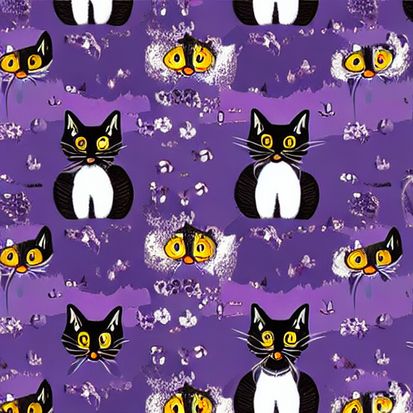

# Text to Image Generator using Stable Diffusion

This project demonstrates a **Text to Image** application developed using `Tkinter` and `Stable Diffusion`. The application allows users to generate images from textual prompts by leveraging a pre-trained model. Users can enter any prompt and click the **Generate** button to view the generated image.

## Features
- **Prompt-Based Generation:** Enter a text prompt and generate an image based on it.
- **Image Display:** Displays the generated image within the application.
- **Clear Prompt:** Allows clearing the prompt text field.
- **Download Option:** Save the generated image locally.



## How to Use
1. Clone this repository:
    ```bash
    git clone https://github.com/jenish201/Text_to_image.git
    ```

2. Install the required dependencies:
    ```bash
    pip install -r requirements.txt
    ```

3. Run the application:
    ```bash
    python main.py
    ```

## Project Dependencies
- Python 3.9+
- [Torch](https://pytorch.org/get-started/locally/)
- [Diffusers](https://github.com/huggingface/diffusers)
- [CustomTkinter](https://github.com/TomSchimansky/CustomTkinter)
- [Pillow](https://pillow.readthedocs.io/en/stable/)
